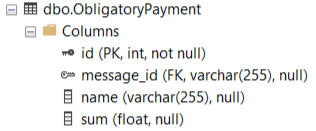

# Тестовое задание 
## Отчёт о проделанной работе

---
# ВАЖНО

> Для корректной работы кода нужен файл config.py, в нём хранятся 4 переменные:
>
> SERVER_NAME - это имя сервера БД
> 
> DATABASE_NAME - название БД (в моём случае SCB)
> 
> DADATA_TOKEN - токен для взаимодействия с API Dadata
> 
> DADATA_SECRET - секретный ключ для взаимодействия с API Dadata
> 
> ФАЙЛА НЕТ В РЕПОЗИТОРИИ СОГЛАСНО ПРАВИЛАМ ЗАЩИТЫ КОНФИДЕНЦИАЛЬНОЙ ИНФОРМАЦИИ
> 
> НЕОБХОДИМО СОЗДАТЬ И ЗАПОЛНИТЬ ФАЙЛ САМОСТОЯТЕЛЬНО

---

## Задача 1 

### Декодирование, парсинг .xml файла и запись данных в БД
#### Requirements: bs4 (для парсинга .xml), pypyodbc (для взаимодействия с БД), dadata (для стандартизации адреса)
#### База данных: MS SQL

Решение:

Код декодирования файла, создания таблиц, добавления данных можно увидеть в файле 
>main.py

В ходе анализа выявил 6 сущностей: 

* Debtor
* Publisher 
* Bank
* ObligatoryPayment 
* MonetaryObligation 
* ExtrajudicialBankruptcyMessage

Также посчитал должным выделить предыдущие имена пользователей в отдельную таблицу PreviousName

7 таблиц:

1. _Таблица Debtor:_
      
    Структура:
      
    
      
    Результат:
      
    
  
2. _Таблица PreviousName (many to many):_
      
    Структура:
      
    
      
    Результат:
      
    
  
3. _Таблица Publisher:_
      
    Структура:
      
    
      
    Результат:
      
    
  
4. _Таблица Bank (уникальность по БИК):_
      
    Структура:
      
    
      
    Результат:
      
    
  
5. _Таблица MonetaryObligation:_
      
    Структура:
      
    
      
    Результат:
      
    
  
6. _Таблица ObligatoryPayment:_
      
    Структура:
      
    
      
    Результат:
      
    
  
7. _Таблица ExtrajudicialBankruptcyMessage:_
      
    Структура:
      
    
      
    Результат:
      
    
  
## Задача 2
### SQL запросы

Код запросов представлен в папке
>Queries

Решение:

- Запрос a:

    
  
- Запрос b:

    
  
- Запрос c:

    
  
## Задача 3
### Визуализация данных
